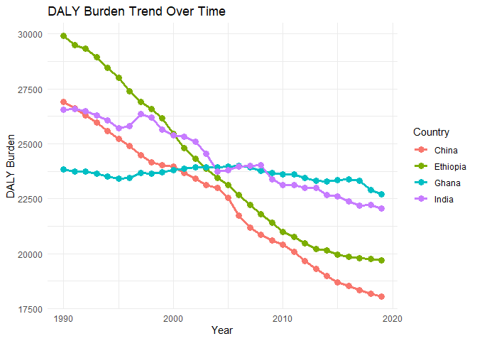

Burden of Disease Report
================
Sisay Wondaya
2024-10-10

``` r
# Load necessary packages
pacman::p_load(tidyverse, knitr, here, ggplot2)

# Import the non-communicable diseases data
data_ncd <- read_csv(here("data/burden-of-disease-ncd.csv"))
```

    ## Rows: 8010 Columns: 4
    ## -- Column specification --------------------------------------------------------
    ## Delimiter: ","
    ## chr (2): Entity, Code
    ## dbl (2): Year, DALYs (Disability-Adjusted Life Years) - Non-communicable dis...
    ## 
    ## i Use `spec()` to retrieve the full column specification for this data.
    ## i Specify the column types or set `show_col_types = FALSE` to quiet this message.

``` r
head(data_ncd, 5)
```

    ## # A tibble: 5 x 4
    ##   Entity      Code   Year DALYs (Disability-Adjusted Life Years) - Non-communi~1
    ##   <chr>       <chr> <dbl>                                                  <dbl>
    ## 1 Afghanistan AFG    1990                                                 41789.
    ## 2 Afghanistan AFG    1991                                                 40756.
    ## 3 Afghanistan AFG    1992                                                 40117.
    ## 4 Afghanistan AFG    1993                                                 40402.
    ## 5 Afghanistan AFG    1994                                                 40826.
    ## # i abbreviated name:
    ## #   1: `DALYs (Disability-Adjusted Life Years) - Non-communicable diseases - Sex: Both - Age: Age-standardized (Rate)`

Filtering the necessary dataset

``` r
# Filter the dataset to include only the three countries chosen by your group.
data_ncd_mini <- data_ncd %>%
  filter(Entity %in% c("India","China","Ghana","Ethiopia")) %>%
 rename(DALY = colnames( data_ncd)[4]) %>%
  select(-Code)
head(data_ncd_mini, 5)
```

    ## # A tibble: 5 x 3
    ##   Entity  Year   DALY
    ##   <chr>  <dbl>  <dbl>
    ## 1 China   1990 26900.
    ## 2 China   1991 26620.
    ## 3 China   1992 26298.
    ## 4 China   1993 25969.
    ## 5 China   1994 25579.

Table of Estimates for NCD Burden Over Time

``` r
# Here render a table for the DALY burden over time for the three countries. 
# You should pivot the data wider to show each country in a separate column.
data_ncd_wide <- data_ncd_mini %>%
  pivot_wider(names_from = Entity,         # Country becomes column names
    values_from = DALY)  # Values to be spread across country
# Use kable() from the knitr package to render the table.

data_ncd_wide_table <- knitr::kable(data_ncd_wide,  "simple")
data_ncd_wide_table
```

| Year |    China | Ethiopia |    Ghana |    India |
|-----:|---------:|---------:|---------:|---------:|
| 1990 | 26899.54 | 29898.41 | 23834.64 | 26554.09 |
| 1991 | 26620.36 | 29486.17 | 23738.53 | 26596.63 |
| 1992 | 26298.02 | 29343.40 | 23729.19 | 26494.62 |
| 1993 | 25968.73 | 28937.71 | 23627.99 | 26294.26 |
| 1994 | 25578.53 | 28462.61 | 23517.61 | 26072.98 |
| 1995 | 25225.82 | 28014.17 | 23414.67 | 25704.34 |
| 1996 | 24890.40 | 27395.15 | 23449.32 | 25794.08 |
| 1997 | 24492.28 | 26917.13 | 23667.81 | 26355.52 |
| 1998 | 24173.12 | 26579.43 | 23648.54 | 26193.81 |
| 1999 | 24025.06 | 26154.17 | 23702.79 | 25628.72 |
| 2000 | 23974.24 | 25458.76 | 23789.37 | 25402.28 |
| 2001 | 23681.81 | 24804.32 | 23860.69 | 25326.27 |
| 2002 | 23420.51 | 24315.75 | 23917.47 | 25087.93 |
| 2003 | 23131.23 | 23866.15 | 23933.54 | 24536.36 |
| 2004 | 22983.46 | 23455.24 | 23933.72 | 23726.90 |
| 2005 | 22531.40 | 23124.48 | 23967.60 | 23809.74 |
| 2006 | 21746.74 | 22664.14 | 23982.08 | 23947.92 |
| 2007 | 21170.78 | 22222.70 | 23947.44 | 23997.51 |
| 2008 | 20850.75 | 21799.94 | 23758.24 | 24014.73 |
| 2009 | 20605.98 | 21396.34 | 23676.60 | 23396.45 |
| 2010 | 20410.24 | 20976.46 | 23608.84 | 23134.68 |
| 2011 | 20090.72 | 20750.25 | 23596.51 | 23120.89 |
| 2012 | 19665.65 | 20462.53 | 23460.98 | 23002.85 |
| 2013 | 19303.81 | 20229.40 | 23332.25 | 22981.07 |
| 2014 | 18996.79 | 20138.48 | 23297.30 | 22676.67 |
| 2015 | 18688.31 | 19970.90 | 23349.29 | 22608.59 |
| 2016 | 18522.67 | 19853.51 | 23380.50 | 22389.00 |
| 2017 | 18354.48 | 19809.50 | 23324.08 | 22197.81 |
| 2018 | 18185.74 | 19766.89 | 22905.58 | 22204.26 |
| 2019 | 18058.96 | 19689.46 | 22702.90 | 22071.57 |

Plot Showing Trends in NCD Burden Over Time

    ## Warning: Using `size` aesthetic for lines was deprecated in ggplot2 3.4.0.
    ## i Please use `linewidth` instead.
    ## This warning is displayed once every 8 hours.
    ## Call `lifecycle::last_lifecycle_warnings()` to see where this warning was
    ## generated.

<!-- -->

Summary of NCD Burden Findings

From the finding we observe that China and Ethiopia has shown a
remarkable decline in the DALY from 1990 to 2020. On the other hand,
Ghana has shown a steady change over tthe specified period. Among the
four country, the maximum DALY value was seen by Ethiopians In the late
time back in 1990 while the min is by Chinese in 2020.
